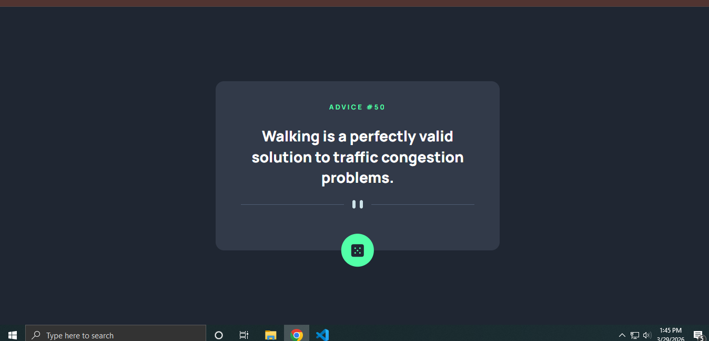

# Frontend Mentor - Advice generator app solution

This is a solution to the [Advice generator app challenge on Frontend Mentor](https://www.frontendmentor.io/challenges/advice-generator-app-Qd_96sRE7). Frontend Mentor challenges help you improve your coding skills by building realistic projects.

## Table of contents

- [Overview](#overview)
  - [The challenge](#the-challenge)
  - [Screenshot](#screenshot)
  - [Links](#links)
- [My process](#my-process)
  - [Built with](#built-with)
  - [What I learned](#what-i-learned)
- [Author](#author)

## Overview

### The challenge

Users should be able to:

- View the optimal layout for the app depending on their device's screen size
- See hover states for all interactive elements on the page
- Generate a new piece of advice by clicking the dice icon

### Screenshot



### Links

- Solution URL: [[Add your GitHub URL here](https://github.com/dreamer111111/advice-generator-app-html-css-js-api)]
- Live Site URL: []

## My process

### Built with

- Semantic HTML5 markup
- CSS custom properties (Variables)
- Flexbox
- Mobile-first workflow
- **CSS Clamp** for responsive sizing
- **Fetch API** with Async/Await
- **Media Queries** for decorative assets

### What I learned

During this project, I focused on making the application accessible and efficient. I learned how to use `aria-label` for icon-only buttons and how to handle API caching issues by appending a timestamp to the URL.

Example of the cache-busting fetch logic:
```js
const url = "[https://api.adviceslip.com/advice?t=](https://api.adviceslip.com/advice?t=)" + new Date().getTime();
const response = await fetch(url);

```
### Author

Frontend Mentor - @dreamer111111 [https://www.frontendmentor.io/profile/dreamer111111]

Twitter - Rudro Roy   [https://x.com/royrudro032]